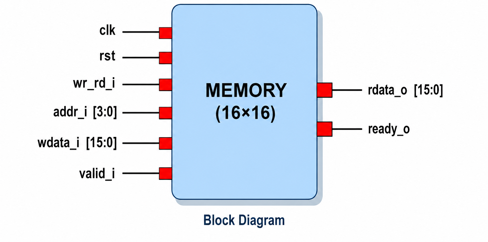
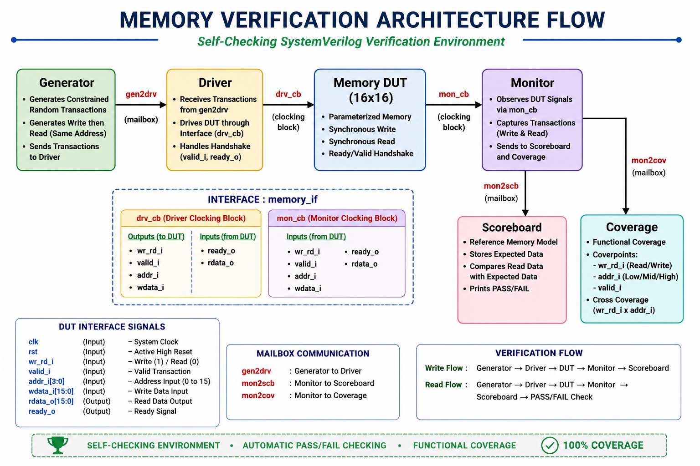
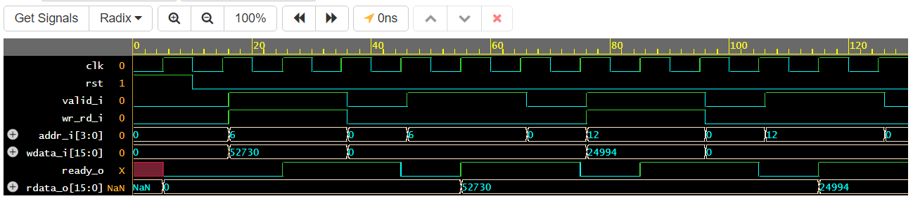
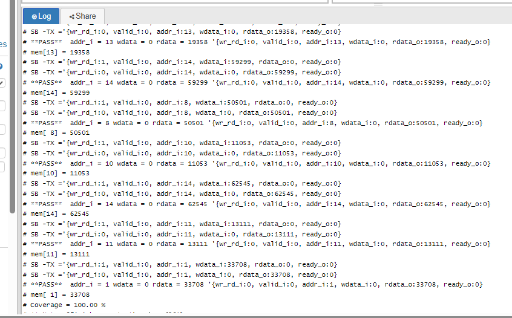
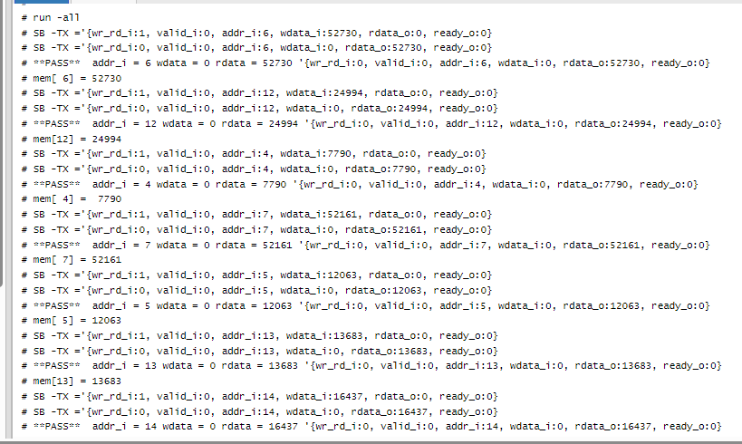
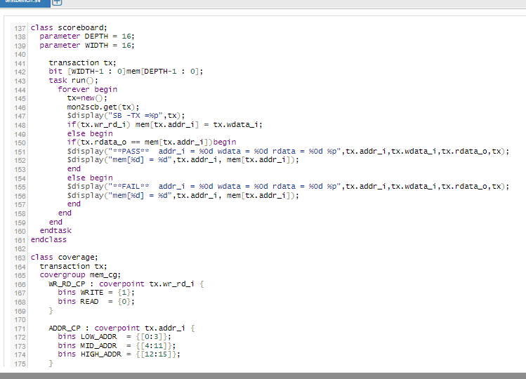

# Self-Checking Constrained-Random Verification of a Parameterized 16×16 Synchronous Memory Using SystemVerilog, Scoreboard, and Functional Coverage

## Project Overview

This project implements a complete self-checking Design Verification environment for a parameterized 16×16 synchronous memory using SystemVerilog.

The verification environment utilizes constrained-random stimulus generation, mailbox-based communication, interface and clocking blocks, automatic scoreboard checking, and functional coverage collection.

The testbench verifies memory write and read operations while ensuring correct DUT behavior through automatic PASS/FAIL checking.

---

## Key Features

- Parameterized 16×16 Synchronous Memory
- Constrained-Random Verification
- Self-Checking Verification Environment
- Generator, Driver (BFM), Monitor, and Scoreboard
- Mailbox-Based Communication
- Interface and Clocking Blocks
- Functional Coverage Collection
- Read-After-Write Verification
- Automatic PASS/FAIL Checking
- RTL Schematic Analysis
- Waveform-Based Verification

---

## Memory Configuration

| Parameter | Value |
|------------|---------|
| DEPTH | 16 |
| WIDTH | 16 |
| ADDR_WIDTH | 4 |

---

## DUT Interface

### Inputs

| Signal | Width | Description |
|----------|----------|-------------|
| clk | 1 | System Clock |
| rst | 1 | Active-High Reset |
| wr_rd_i | 1 | Write/Read Control |
| valid_i | 1 | Valid Transaction Indicator |
| addr_i | 4 | Memory Address Input |
| wdata_i | 16 | Write Data Input |

### Outputs

| Signal | Width | Description |
|----------|----------|-------------|
| rdata_o | 16 | Read Data Output |
| ready_o | 1 | Ready Signal |

---

## Verification Architecture

The verification environment consists of:

- Generator
- Driver (BFM)
- Memory DUT
- Monitor
- Scoreboard
- Functional Coverage

### Verification Flow

```text
Generator
    │
    ▼
Driver (BFM)
    │
    ▼
Memory DUT
    │
    ▼
Monitor
  │     │
  │     └────────► Coverage
  │
  └──────────────► Scoreboard
```

---

## Functional Coverage

Coverage Implemented:

- Read Operations
- Write Operations
- Address Coverage
- Valid Transaction Coverage
- Cross Coverage (Operation × Address)

### Coverage Result

```text
Functional Coverage Achieved = 100%
```

---

## Verification Results

The self-checking scoreboard automatically compares expected and actual DUT outputs.

### Sample Simulation Results

```text
PASS : addr_i = 6  rdata = 52730
PASS : addr_i = 12 rdata = 24994
PASS : addr_i = 4  rdata = 7790
```

### Simulation Summary

- Compile Errors = 0
- Simulation Errors = 0
- PASS Transactions = Successful
- Functional Coverage = 100%

---

# Project Images

## 1. Memory Block Diagram

**File:** `Block_diagram.png`

Shows:
- 16×16 Memory Architecture
- Input and Output Interface Signals
- Overall DUT Structure



---

## 2. Verification Architecture

**File:** `Verification_architecture.png`

Shows:
- Generator
- Driver (BFM)
- Memory DUT
- Monitor
- Scoreboard
- Coverage
- Mailbox Communication Flow



---

## 3. RTL Schematic

**File:** `Memory_Schematic.pdf`

Shows:
- Vivado Elaborated RTL Schematic
- Register-Based Memory Structure
- Read Data Multiplexer
- Internal Memory Implementation


---

## 4. Simulation Waveform

**File:** `Waveform.png`

Shows:
- Write Transactions
- Read Transactions
- Ready/Valid Handshake
- Address and Data Activity
- Correct DUT Operation



---

## 5. Functional Coverage Report

**File:** `Coverage.png`

Shows:
- Functional Coverage Statistics
- Coverage Achievement
- Coverage Summary



---

## 6. Simulation Output

**File:** `Memory_output.png`

Shows:
- PASS Transaction Logs
- Scoreboard Results
- Read Data Verification



---

## 7. Scoreboard Logic

**File:** `Scoreboard_logic.png`

Shows:
- Reference Memory Model
- Expected vs Actual Data Comparison
- PASS/FAIL Checking Mechanism



---

## 8. Project Report

**File:** `MEMORY_RTL_Verification_Specification.pdf`

Contains:
- Memory Design Description
- Verification Methodology
- Coverage Results
- Verification Analysis


---

## Tools Used

- SystemVerilog 
- QuestaSim
- Vivado
- EDA Playground

---

## Learning Outcomes

This project strengthened my understanding of:

- RTL Design Verification
- Constrained-Random Verification
- Functional Coverage
- Scoreboard-Based Verification
- Mailbox Communication
- Interface and Clocking Blocks
- Verification Planning
- Self-Checking Testbench Methodology

---

## Repository Files

```text
SystemVerilog_Memory_Verification
│
├── memory_rtl.sv
├── memory_tb.sv
├── Block_diagram.png
├── Verification_architecture.png
├── Memory_Schematic.pdf
├── Waveform.png
├── Coverage.png
├── Memory_output.png
├── Scoreboard_logic.png
├── MEMORY_RTL_Verification_Specification.pdf
└── README.md
```

---

## Author

**Narasimhamurthy B**

Electronics and Communication Engineering (ECE)

### Areas of Interest

- RTL Design Verification
- SystemVerilog
- UVM
- Functional Verification
- Semiconductor Design

---

### Project Status

✔ Memory RTL Verified Successfully  
✔ Self-Checking Scoreboard Implemented  
✔ Functional Coverage Achieved = 100%  
✔ Simulation Completed Successfully  
✔ RTL Schematic Generated and Validated
